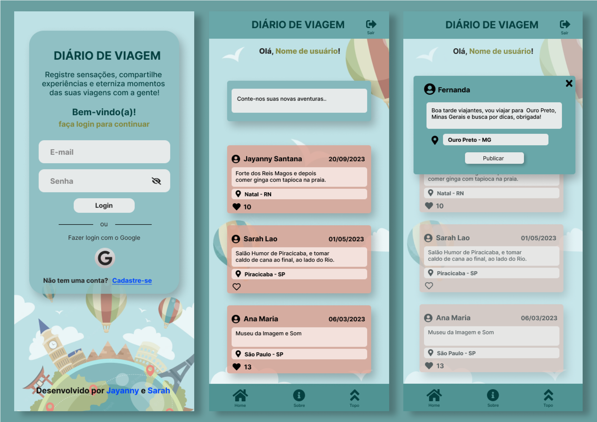
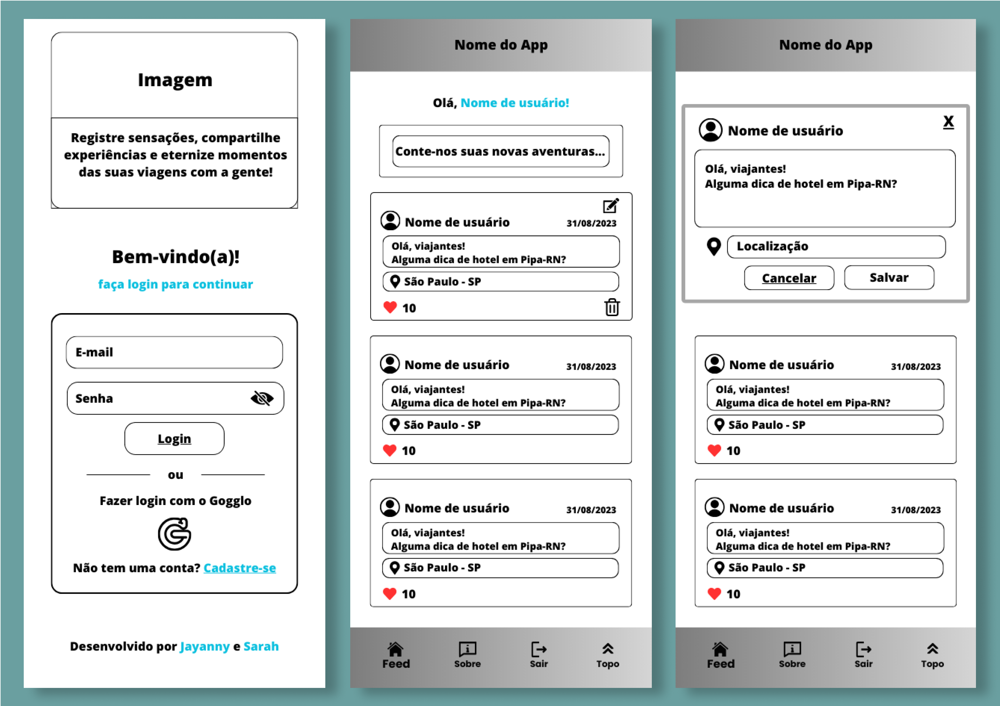
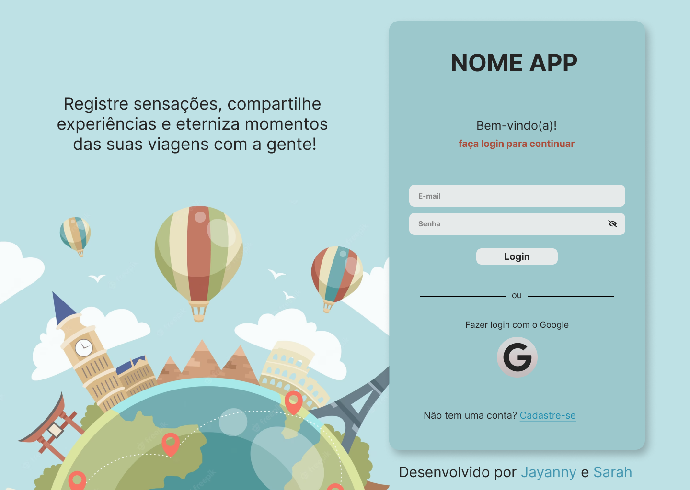
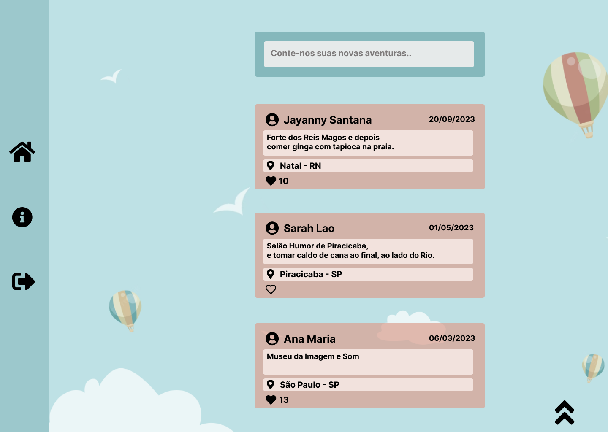
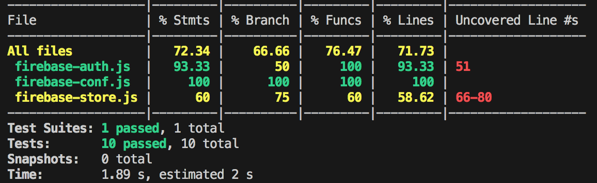

# Social Network - Diário de Viagem 

### Índice
* [1. Prefácio](#prefácio)
* [2. Descrição do Projeto](#descrição-do-projeto)
* [3. Histórias de usuário](#história-de-usuário)
* [4. Desenho de interface do usuário](#desenho-de-interface-do-usuário)
* [5. Testes unitários](#testes-unitários)
* [6. Acesso ao Projeto](#acesso-ao-projeto)
* [7. Especificações Técnicas](#especificações-técnicas) 
* [8. Implementações futuras](#implementações-futuras)
* [9. Referências](#referência)
* [10. Desenvolvedora do Projeto](#desenvolvedora)

## 1. Prefácio
Este projeto foi desenvolvido como parte do bootcamp da Laboratória e consiste em um projeto de nível 3 de um catálogo de projetos de complexidade crescente, associados a objetivos de aprendizagem concretos. Se trata de uma aplicação web que tem como objetivo construir uma Single-page Application (SPA) responsiva e que não se limita a uma única página, mas oferece uma experiência multi-tela e permite tanto a leitura quanto a escrita de dados de maneira eficiente e intuitiva, permitindo à qualquer usuário criar uma conta de acesso, logar-se com ela, criar, editar, deletar e dar likes em publicações.

## 2. Descrição do Projeto 
O "Diário de Viagem" é uma plataforma digital concebida para atender tanto os entusiastas de viagens ávido por aventura quanto os viajantes mais casuais. Ele não é apenas um aplicativo ou site, é um companheiro de viagem virtual que transforma suas aventuras em histórias para serem lembradas e compartilhadas. Seja para inspiração futura, para ajudar outros a explorar novos horizontes ou simplesmente para reviver momentos especiais, este produto foi projetado para satisfazer os viajantes em todos os lugares, ajudando-os a criar memórias inesquecíveis. 

## 3. Histórias de usuário
As histórias de usuário definiram os requisitos principais para a criação da aplicação web, cada história se concentra em uma funcionalidade específica, tornando a experiência do usuário mais completa e agradável.

### Histórias de usuário 0 - Roteamento das páginas

Como usuário, quero poder navegar entre as páginas, para que eu possa ter uma conexão entre elas.

#### Critérios de aceitação:

    Criar o SPA das páginas (loging, cadastro, feed, sobre);
    Usuário se movimentar entre as páginas;
    SPA com estrutura HTML simples.

### Histórias de usuário 1 - Criação de conta de usuário

Como usuário, quero poder me cadastrar com um e-mail e senha, para que eu possa me conectar com outros viajantes.

#### Critérios de aceitação:

    Botão para cadastro de usuário;
    Segunda página para inserir dados de cadastro do usuário;
    Campo para nome de usuário;
    Mensagem sobre nome de usuário já existe;
    Campo para e-mail;
    Somente usuários com contas válidas têm acesso permitido;
    A conta do usuário deve ser um email válido;
    Mensagem sobre e-mail inválido;
    Campo para senha;
    Campo para confirmar senha;
    O que o usuário digita no campo de senha (input) deve ser secreto;
    Mensagem sobre campo de senha vazio;
    Botão para cadastro de usuário;
    Quando o formulário de registro é enviado, ele deve ser validado;
    Se houver erros, mensagens descritivas devem ser exibidas para ajudar o usuário.

### Histórias de usuário 2 - Login de conta de usuário

Como usuário, quero poder logar em minha conta de acesso com um e-mail e senha.

#### Critérios de aceitação:

    Campo para enserir e-mail; 
    Campo para enserir senha;
    Botão de login;
    Mensagem sobre e-mail inválido;
    Mensagem sobre senha incorreta;
    Somente usuários com contas válidas têm acesso permitido;
    O que o usuário digita no campo de senha (input) deve ser secreto;
    Quando o formulário de login é enviado, ele deve ser validado;
    Se houver erros, mensagens descritivas devem ser exibidas para ajudar o usuário.

### Histórias de usuário 3 - Publicações no Feed

Como usuário, quero poder compartilhar experiências vividas em uma viagem, para que eu possa eternizar esses momentos.

#### Critérios de aceitação:

    Campo para digitar texto;
    Botão para publicar;
    Ao recarregar o aplicativo, é necessário verificar se o usuário está logado antes de exibir o conteúdo.

### Histórias de usuário 4 - Editar publicações

Como usuário, quero poder editar minhas publicações, para que eu possa atualizar as informações do feed.

#### Critérios de aceitação:

    ícone para editar publicação;
    Ao clicar em editar um post, você deve alterar o texto para um input que permite editar o texto e salvar as alterações.
    Botão para salvar informações editadas;
    Ao salvar as informações alteradas, elas devem ser exibidas no feed.

### Histórias de usuário 5 - Excluir publicações

Como usuário, quero poder excluir minhas postagens, para que eu possa modificar meu feed.

#### Critérios de aceitação:

    ícone de lixeira para excluir;
    Poder excluir as minhas postagens.
    Botão para excluir publicação;
    Ao confirmar a exclusão, o feed deve ser atualizado.

### Histórias de usuário 6 - Like em publicações

Como usuário, quero poder dar like e deslike em publicações de outros usuários, para que eu possa interagir com outros viajantes.

#### Critérios de aceitação:

    Ícone de like;
    Poder dar e remover likes em uma publicação, com o máximo de um like por usuário.
    Visualizar contagem de likes.

### Histórias de usuário 7 - Conectando com uma conta do Google

Como usuário, quero poder me cadastrar utilizando uma conta do Google, para que eu possa me conectar de forma mais rápida.

#### Critérios de aceitação:

    ícone para conexão com e-mail do Google;
    Quando o formulário de registro é enviado, ele deve ser validado;
    Se houver erros, mensagens descritivas devem ser exibidas para ajudar o usuário.

### História de Usuário 8 - Acesso Multiplataforma:

Como usuário, quero poder acessar o site da plataforma de qualquer dispositivo, para ter uma experiência agradável independentemente do dispositivo que estou usando.

#### Critérios de Aceitação:

    A plataforma deve ser responsiva, permitindo que se adapte automaticamente ao tamanho e resolução da tela do dispositivo.
    A navegação, elementos interativos e conteúdo da plataforma devem ser facilmente acessíveis e utilizáveis em diferentes dispositivos.
    As funcionalidades da plataforma devem permanecer ativas em todos os dispositivos, garantindo que os usuários tenham acesso a todos os recursos.

### Definição de Pronto 

Todas as histórias de usuários tiveram como definição de pronto: 
    * Ser uma SPA.
    * Ser responsivo.
    * Receber code review de pelo menos uma parceira de outra equipe.
    * Fazer testes unitários.
    * Fazer testes manuais buscando erros e imperfeições simples.
    * Fazer testes de usabilidade e incorporar o feedback dos usuários como melhorias.
    * Fazer deploy do aplicativo e marcar a versão (git tag).

## 4. Desenho de interface do usuário 

### Protótipo de alta fidelidade Mobile

### Protótipo de baixa fidelidade Mobile

### Protótipo de alta fidelidade Desktop - Login

### Protótipo de alta fidelidade Desktop - Feed

## 5. Testes unitários
Os testes unitários cobriram o mínimo 70% de statements, functions, lines e branches conforme critérios.

## 6. Acesso 
Link projeto [Social Network - Diário de Viagem](https://social-network-c87de.web.app/). 

## 7. Especificações Técnicas

O projeto foi desenvolvido utilizando como ferramentas e tecnologias:

    * HTML5
    * CSS3
    * JavaScript
    * Visual Studio Code
    * Firebase
    * Node.js
    * Jest
    * Mock
    * Vite
    * GitBash
    * GitHub
    * Figma

## 8. Implementações futuras
    * Aumentar a cobertura dos testes unitários;
    * Adicionar responsividade para que se adapte a mais telas;
    * Melhorias da funcionalidade do modal de editar e deletar;

## 9. Referências

Imgens:
    
    Icone Google - [Flaticon](https://www.flaticon.com/br/icones-gratis/google)
    Background: Travel background - [Freepik](https://www.freepik.com/free-vector/travel-background_3792962.htm#&position=0&from_view=search&track=ais)

Ícones:
    
    GitHub - [Fontawesome](https://fontawesome.com/icons/github?f=brands&s=solid)
    Linkedin - [Fontawesome](https://fontawesome.com/icons/linkedin?f=brands&s=solid)
    Face 3 - [Google ícons](https://fonts.google.com/icons?icon.query=user&selected=Material+Symbols+Outlined:face_3:FILL@0;wght@400;GRAD@0;opsz@24)
    Account Circle - [Google ícons](https://fonts.google.com/icons?icon.query=user&selected=Material+Symbols+Outlined:account_circle:FILL@0;wght@400;GRAD@0;opsz@24)
    Logout - [Google ícons](https://fonts.google.com/icons?icon.query=logout&selected=Material+Symbols+Outlined:logout:FILL@0;wght@400;GRAD@0;opsz@24)
    Keyboard Double Arrow Up - [Google ícons](https://fonts.google.com/icons?icon.query=arrows&selected=Material+Symbols+Outlined:keyboard_double_arrow_up:FILL@0;wght@400;GRAD@0;opsz@24)
    Home - [Google ícons](https://fonts.google.com/icons?icon.query=home&selected=Material+Symbols+Outlined:home:FILL@0;wght@400;GRAD@0;opsz@24)
    Info - [Google ícons](https://fonts.google.com/icons?icon.query=info&selected=Material+Symbols+Outlined:info:FILL@0;wght@400;GRAD@0;opsz@24)
    Favorite - [Google ícons](https://fonts.google.com/icons?icon.query=like&selected=Material+Symbols+Outlined:favorite:FILL@0;wght@400;GRAD@0;opsz@24)
    Delete - [Google ícons](https://fonts.google.com/icons?icon.query=delete&selected=Material+Symbols+Outlined:delete:FILL@0;wght@400;GRAD@0;opsz@24)
    Edit Square - [Google ícons](https://fonts.google.com/icons?icon.query=edit&selected=Material+Symbols+Outlined:edit_square:FILL@0;wght@400;GRAD@0;opsz@24)

Fontes:

    Roboto - [Google Fonts](https://fonts.google.com/specimen/Roboto?icon.query=user&selected=Material+Symbols+Outlined:face_3:FILL@0;wght@400;GRAD@0;opsz@24&query=roboto)

## 10. Desenvolvedora do Projeto
[Jay Santana](https://github.com/jay-santana).

[Sarah Lao](https://github.com/laosarah).